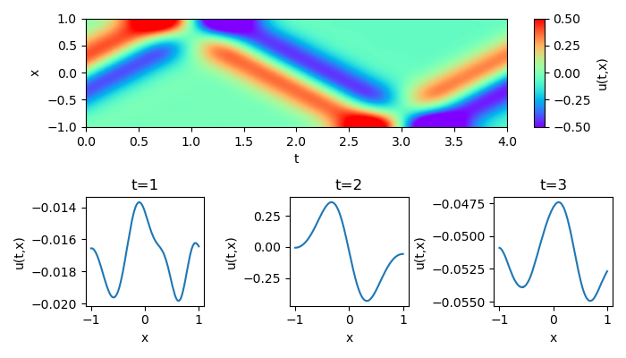

# pinn_wave

This module implements the Physics Informed Neural Network (PINN) model for the wave equation. The wave equation is given by `(d^2/dt^2 - c^2 d^2/dx^2)u = 0`, where `c` is the wave velocity. We give the initial condition `u(t=0, x) = sin(k*x - omega*t) * exp(-(k*x - omega*t)**2)` and `du(t=0, x)/dt`. Dirichlet or Neumann boundary condition is given at `x = -1,+1`. The PINN model predicts `u(t, x)` for the input `(t, x)`.

## Description

The PINN is a deep learning approach to solve partial differential equations. Well-known finite difference, volume and element methods are formulated on discrete meshes to approximate derivatives. Meanwhile, the automatic differentiation using neural networks provides differential operations directly. The PINN is the automatic differentiation based solver and has an advantage of being meshless.

The effectiveness of PINNs is validated in the following works.

* [M. Raissi, et al., Physics Informed Deep Learning (Part I): Data-driven Solutions of Nonlinear Partial Differential Equations, arXiv: 1711.10561 (2017).](https://arxiv.org/abs/1711.10561)
* [M. Raissi, et al., Physics Informed Deep Learning (Part II): Data-driven Discovery of Nonlinear Partial Differential Equations, arXiv: 1711.10566 (2017).](https://arxiv.org/abs/1711.10566)

In addition, an effective convergent optimizer is required to solve the differential equations accurately using PINNs. The stochastic gradient dicent is generally used in deep learnigs, but it only depends on the primary gradient (Jacobian). In contrast, the quasi-Newton based approach such as the limited-memory Broyden-Fletcher-Goldfarb-Shanno method for bound constraints (L-BFGS-B) incorporates the quadratic gradient (Hessian), and gives a more accurate convergence.

Here we implement a PINN model with the L-BFGS-B optimization for the wave equation.
Scripts is given as follows.

* *lib : libraries to implement the PINN model for a projectile motion.*
    * `layer.py` : computing 1st and 2nd derivatives as a custom layer.
    * `network.py` : building a keras network model.
    * `optimizer.py` : implementing the L-BFGS-B optimization.
    * `pinn.py` : building a PINN model.
    * `tf_silent.py` : suppressing tensorflow warnings
* `main.py` : main routine to run and test the PINN solver.

## Requirement

You need Python 3.6 and the following packages.

| package    | version (recommended) |
| -          | -      |
| matplotlib | 3.2.1  |
| numpy      | 1.18.1 |
| scipy      | 1.3.1  |
| tensorflow | 2.1.0  |

GPU acceleration is recommended in the following environments.

| package        | version (recommended) |
| -              | -     |
| cuda           | 10.1  |
| cudnn          | 7.6.5 |
| tensorflow-gpu | 2.1.0 |

## Usage

An example of PINN solver for the wave equation is implemented in `main.py`. The PINN is trained by the following procedure.

1. Building the keras network model
    ```python
    from lib.network import Network
    network = Network.build().
    network.summary()
    ```
    The following table depicts layers in the default network.
    ```
    _________________________________________________________________
    Layer (type)                 Output Shape              Param #
    =================================================================
    input_1 (InputLayer)         [(None, 2)]               0
    _________________________________________________________________
    dense (Dense)                (None, 32)                96
    _________________________________________________________________
    dense_1 (Dense)              (None, 16)                528
    _________________________________________________________________
    dense_2 (Dense)              (None, 16)                272
    _________________________________________________________________
    dense_3 (Dense)              (None, 32)                544
    _________________________________________________________________
    dense_4 (Dense)              (None, 1)                 33
    =================================================================
    Total params: 1,473
    Trainable params: 1,473
    Non-trainable params: 0
    _________________________________________________________________
    ```
2. Building the PINN model (`c` is the wave velocity).
    ```python
    from lib.pinn import PINN
    pinn = PINN(network, c=1).build()
    ```
3. Building training input.
    ```python
    # create training input
    tx_eqn = np.random.rand(num_train_samples, 2)
    tx_eqn[..., 0] = 4*tx_eqn[..., 0]                # t =  0 ~ +4
    tx_eqn[..., 1] = 2*tx_eqn[..., 1] - 1            # x = -1 ~ +1
    tx_ini = np.random.rand(num_train_samples, 2)
    tx_ini[..., 0] = 0                               # t = 0
    tx_ini[..., 1] = 2*tx_ini[..., 1] - 1            # x = -1 ~ +1
    tx_bnd = np.random.rand(num_train_samples, 2)
    tx_bnd[..., 0] = 4*tx_bnd[..., 0]                # t =  0 ~ +4
    tx_bnd[..., 1] = 2*np.round(tx_bnd[..., 1]) - 1  # x = -1 or +1
    x_train = [tx_eqn, tx_ini, tx_bnd]
    ```
4. Building training output. We give an initial wave distribution `u0` and the 1st derivative of t `du0/dt`.
    ```python
    # initial wave distribution
    def u0(tx, c=1, k=2, sd=0.5):
        t = tx[..., 0, None]
        x = tx[..., 1, None]
        z = k*x - (c*k)*t
        return tf.sin(z) * tf.exp(-(0.5*z/sd)**2)
    # du0/dt
    def du0_dt(tx):
        with tf.GradientTape() as g:
            g.watch(tx)
            u = u0(tx)
        du_dt = g.batch_jacobian(u, tx)[..., 0]
        return du_dt
    # create training output
    u_zero = np.zeros((num_train_samples, 1))
    u_ini = u0(tf.constant(tx_ini)).numpy()
    du_dt_ini = du0_dt(tf.constant(tx_ini)).numpy()
    y_train = [u_zero, u_ini, du_dt_ini, u_zero]
    ```
5. Optimizing the PINN model for the training data.
    ```python
    from lib.optimizer import L_BFGS_B
    lbfgs = L_BFGS_B(model=pinn, x_train=x_train, y_train=y_train)
    lbfgs.fit()
    ```
    The progress is printed as follows. The optimization is terminated for loss ~ 2e-5.
    ```
    Optimizer: L-BFGS-B (maxiter=15000)
    14215/15000 [===========================>..] - ETA: 58s - loss: 2.0296e-05
    ```

An example using Dirichlet boundary condition is demonstrated below.


Another example using Neumann boundary condition is shown below.

